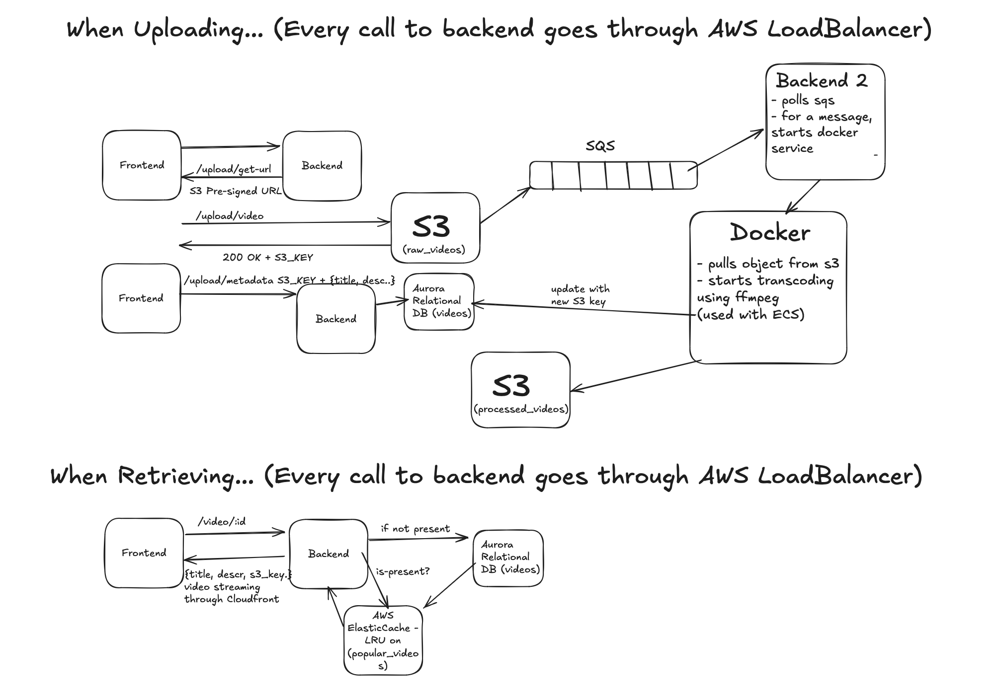

# YT Clone — Video Streaming App

A YouTube-style video streaming platform. Users upload videos, which are processed asynchronously into streamable formats, and watch them through a cross-platform Flutter app.

**Tech stack:** AWS · FastAPI · Redis · Docker · Flutter · PostgreSQL



## Features

- Video upload and playback
- Asynchronous video transcoding pipeline (upload → queue → transcode → stream)
- REST API built with FastAPI
- PostgreSQL for persistent metadata (users, videos, etc.)
- Redis for queueing / caching
- AWS for object storage and video delivery
- Cross-platform Flutter client (mobile / web / desktop)
- Dockerized services for consistent local and production environments

## Architecture

The system is split into four independent components:

| Directory | Description |
|---|---|
| [`backend/`](./backend) | FastAPI REST API: authentication, video metadata, upload handling, and communication with PostgreSQL, Redis and AWS |
| [`consumer/`](./consumer) | Background worker that listens for events (e.g. new uploads) and triggers downstream processing |
| [`transcoder/`](./transcoder) | Converts uploaded videos into streaming-friendly formats and resolutions |
| [`flutter_client/`](./flutter_client) | Flutter app for browsing, uploading and watching videos |

### How it works

1. A user uploads a video from the Flutter client.
2. The backend stores the raw file in AWS storage and saves its metadata in PostgreSQL.
3. An event is pushed to the queue so the upload is processed asynchronously.
4. The consumer picks up the event and hands the video to the transcoder.
5. The transcoder produces streamable output and stores it back in AWS.
6. The client streams the processed video.

See `architecture.png` for the full diagram.

## Prerequisites

- [Docker](https://docs.docker.com/get-docker/) and Docker Compose
- [Flutter SDK](https://docs.flutter.dev/get-started/install)
- Python 3.10+ (if running the backend outside Docker)
- An AWS account with credentials and an S3 bucket
- PostgreSQL and Redis (provided via Docker, or bring your own)

## Getting Started

### 1. Clone the repository

```bash
git clone https://github.com/debanshughosh009/yt_clone.git
cd yt_clone
```

### 2. Configure environment variables

Create a `.env` file in each service directory that needs one (`backend/`, `consumer/`, `transcoder/`). Typical values:

```env
# Database
POSTGRES_DB=yt_clone
POSTGRES_USER=postgres
POSTGRES_PASSWORD=your_password
POSTGRES_HOST=localhost
POSTGRES_PORT=5432

# Redis
REDIS_HOST=localhost
REDIS_PORT=6379

# AWS
AWS_ACCESS_KEY_ID=your_access_key
AWS_SECRET_ACCESS_KEY=your_secret_key
AWS_REGION=your_region
AWS_S3_BUCKET=your_bucket_name
```

> Never commit real credentials. Make sure `.env` is listed in `.gitignore`.

### 3. Run the backend services

```bash
# Start PostgreSQL and Redis
docker compose up -d

# Backend API
cd backend
pip install -r requirements.txt
uvicorn main:app --reload
```

The API will be available at `http://localhost:8000`, with interactive docs at `http://localhost:8000/docs`.

### 4. Run the consumer and transcoder

```bash
cd consumer
# follow the setup in consumer/ (e.g. docker build / python run)

cd ../transcoder
# follow the setup in transcoder/
```

### 5. Run the Flutter client

```bash
cd flutter_client
flutter pub get
flutter run
```

Point the client at your backend URL in its configuration file before running.

## Project Structure

```
yt_clone/
├── backend/          # FastAPI REST API
├── consumer/         # Background event consumer
├── transcoder/       # Video transcoding service
├── flutter_client/   # Flutter frontend
├── architecture.png  # System architecture diagram
└── README.md
```


## Contributing

Contributions are welcome. Fork the repo, create a feature branch, and open a pull request.

```bash
git checkout -b feature/your-feature
git commit -m "Add your feature"
git push origin feature/your-feature
```

## License

Add a license of your choice (e.g. MIT) and reference it here.

## Author

**Debanshu Ghosh** — [@debanshughosh009](https://github.com/debanshughosh009)
